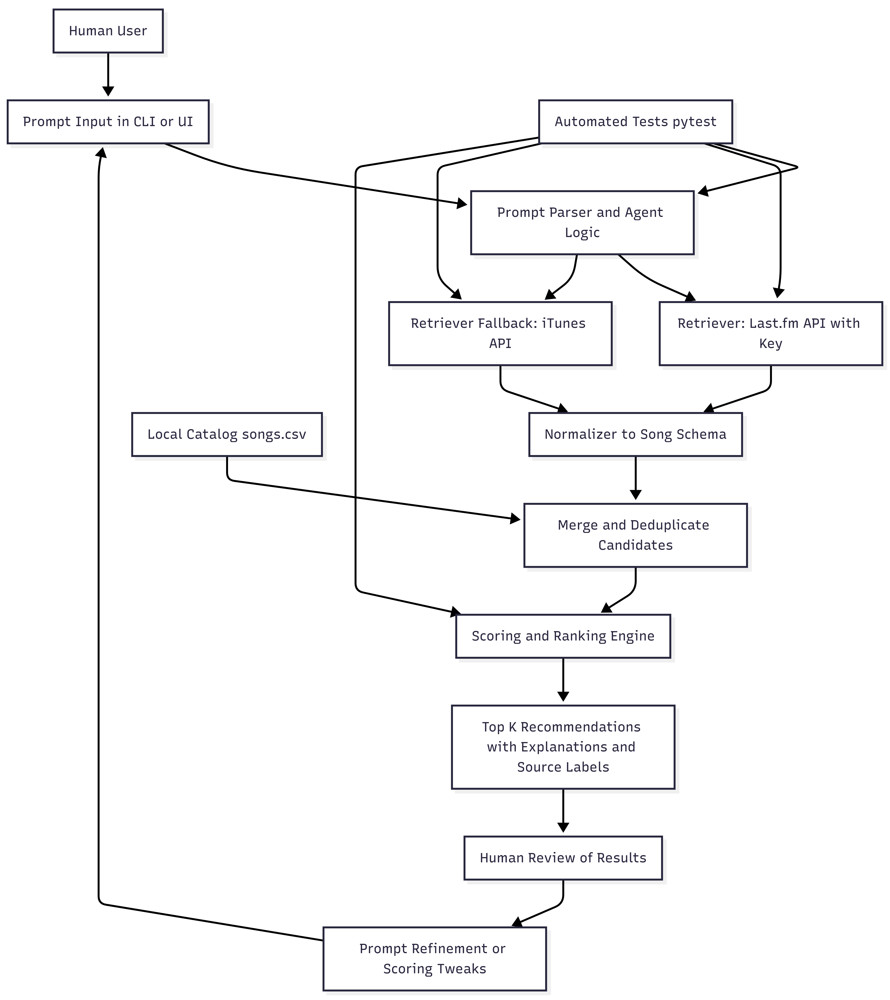

# AI Music Recommender with Internet Retrieval (RAG)

## Title and Summary
This project is an AI-powered music recommender that takes a natural-language request (for example, "something like Metallica but a bit more mellow") and returns ranked song suggestions by combining a local song catalog with internet retrieval.

It matters because it demonstrates a practical Retrieval-Augmented Generation (RAG)-style pattern for recommendation systems: user intent parsing, external data retrieval, schema normalization, explainable scoring, and continuous user feedback.

## Original Project (Modules 1-3)
Original project name: Music Recommender Simulation.

In Modules 1-3, the goal was to build a transparent, content-based recommender using a small static dataset (`data/songs.csv`) and user preferences (genre, mood, energy, acousticness). The system scored songs with simple rules and returned top-k recommendations with short explanations, making recommendation logic easy to inspect and test.

## Architecture Overview
The current architecture extends the original simulation with internet retrieval and fallback behavior.

Main components:
- User Input Interface: Collects free-text prompt from the user.
- Prompt Parser / Agent Logic: Extracts intent (seed artist, mood, energy level, acoustic preference).
- Retriever: Uses Last.fm API when `LASTFM_API_KEY` is set.
- Fallback Retriever: Uses iTunes Search API when no key is present or Last.fm returns no results.
- Normalizer: Converts internet tracks into the internal song schema used by the recommender.
- Recommendation Engine: Merges local + internet songs, deduplicates, scores, ranks, and explains results.
- Tester / Evaluator: Pytest suite validates parsing, retrieval routing, and ranking behavior.
- Human-in-the-loop Review: User checks quality, then iterates prompt or scoring logic.

Data flow (input -> process -> output):
- Input: Natural-language request from user.
- Process: Parse prompt -> retrieve internet tracks -> normalize -> merge with local catalog -> score/rank.
- Output: Top recommendations with explanation and source label (`internet` or `local`).

Where humans/testing check AI results:
- Human review: User inspects relevance of recommendations and refines prompts.
- Automated testing: Unit tests confirm parser behavior, API-key path, fallback path, and ranking integration.

### System Diagram
The architecture diagram is included in the assets folder:



## Setup Instructions
### 1. Clone and enter project
```bash
git clone https://github.com/codepath/ai110-module3show-musicrecommendersimulation-starter.git
cd ai110-module3show-musicrecommendersimulation-starter
```

### 2. Create virtual environment (recommended)
Windows PowerShell:
```powershell
python -m venv .venv
.\.venv\Scripts\Activate.ps1
```

macOS/Linux:
```bash
python -m venv .venv
source .venv/bin/activate
```

### 3. Install dependencies
```bash
python -m pip install -r requirements.txt
```

### 4. (Optional) Enable API key retrieval (Last.fm)
Windows PowerShell:
```powershell
$env:LASTFM_API_KEY="your_lastfm_api_key"
```

If no key is set, the app automatically falls back to iTunes Search API.

### 5. Run the app
```bash
python -m src.main
```

### 6. Run tests
```bash
python -m pytest -q
```

## Sample Interactions
The following are real examples from CLI runs.

### Example 1
Input:
```text
something like Metallica but a bit more mellow
```

Output (top 5):
```text
1. Hotel California by Eagles (Score 8.5)
2. Africa by Toto (Score 8.5)
3. Don't Stop Believin' (2024 Remaster) by Journey (Score 8.5)
4. Vienna by Billy Joel (Score 8.5)
5. Dreams by Fleetwood Mac (Score 8.5)
```

### Example 2
Input:
```text
chill acoustic jazz for studying
```

Output (top 5):
```text
1. At Last by Etta James (Score 9.93)
2. Jazz (We've Got) [Radio Version] by A Tribe Called Quest (Score 8.73)
3. Christmas Time Is Here (Instrumental) by Vince Guaraldi Trio (Score 8.73)
4. A Change Is Gonna Come by Sam Cooke (Score 8.73)
5. Ain't No Sunshine by Bill Withers (Score 8.73)
```

### Example 3
Input:
```text
quit
```

Output:
```text
Goodbye.
```

## Design Decisions and Trade-offs
### Why this design
- Kept a transparent rule-based scorer for explainability.
- Added RAG-style retrieval to increase catalog diversity beyond local CSV data.
- Implemented API-key provider + fallback provider for reliability.

### Trade-offs
- Simplicity vs accuracy: Heuristic prompt parsing is interpretable but less nuanced than full semantic embeddings.
- Feature completeness vs availability: Internet tracks often lack full audio features, so the app infers values from genre/mood cues.
- Stability vs freshness: External APIs improve freshness but can be rate-limited or change behavior.

## Testing Summary
The automated tests cover prompt parsing, API-key and fallback retrieval paths, recommendation ranking/deduplication, and CLI reliability (empty input, quit flow, and interrupt handling). Early failures were caused by missing dependencies and were fixed by installing `requirements.txt`. Current status: `python -m pytest -q` -> 12 passed.

## Reflection
This project reinforced that practical AI systems are pipelines, not just models. The quality of outputs depends on prompt interpretation, data retrieval, schema normalization, ranking logic, and robust fallbacks.

It also highlighted a core problem-solving lesson: build incrementally, verify each component, and keep the system explainable. For recommendation products, interpretability and testing discipline are crucial if you want users and stakeholders to trust the results.
